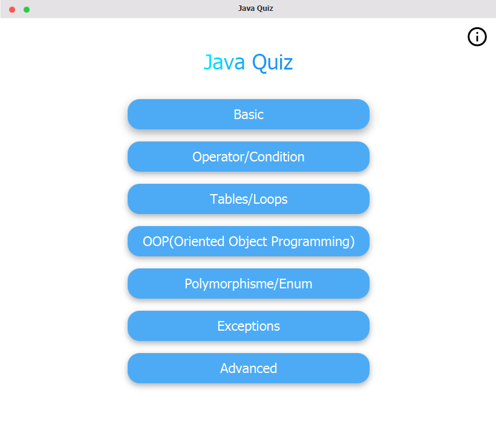
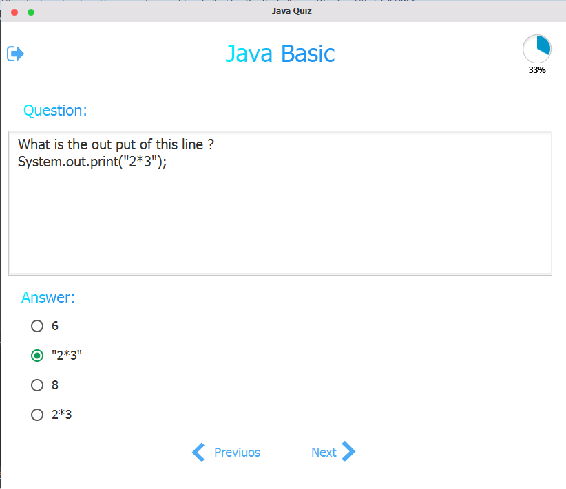
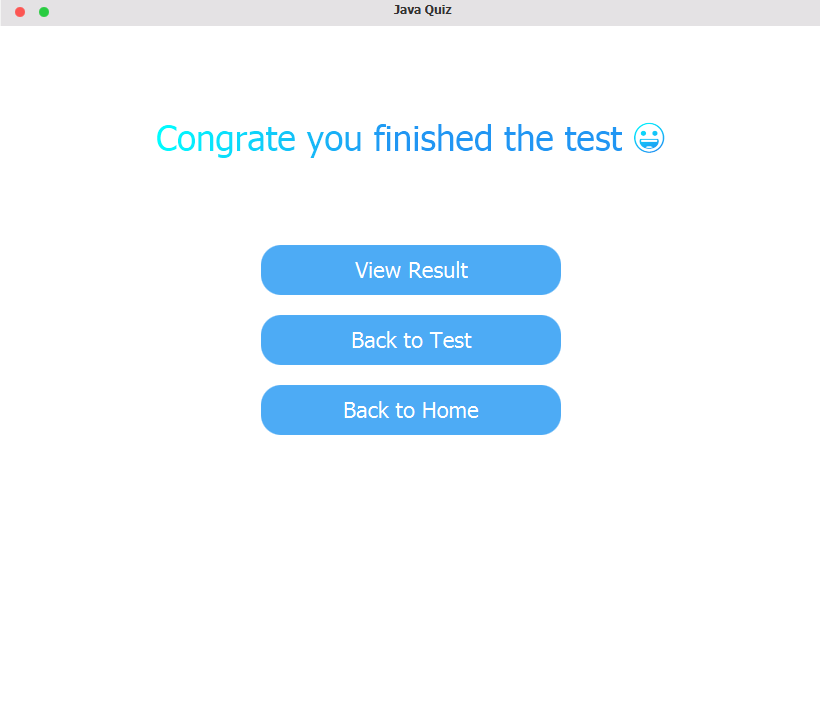

# QuizAppFX

Quiz App is a fun new way to practise, improve, and test your Java skills, and test yourself in a truly.

## Screenshots
Home page                |
:-------------------------:|
  |

Quiz           |  Finish Quiz
:-------------------------:|:-------------------------:
  |  

## Libraries used
* JFoenix (Material design)
* FontAwesomeFx (Icons)
* Connector/J (JDBC)

## Technology used
* JavaFX

## Requirements
* Java version 8 or higher.
* Maven.
* IDE like Intellij IDEA or other.
* MySQL database.

## Installation
1. Download the repository files (project) from the download section or clone this project by typing in the bash the following command:

       git clone https://github.com/HouariZegai/QuizApp-FX.git
2. Open it in Intellij IDEA and let maven download the libraries used (montioned above).
3. Import & execute the SQL queries from the Database folder to the MySQL database.
4. Run the application :D

## License
This project is under the [MIT Licence](https://raw.githubusercontent.com/HouariZegai/QuizApp-FX/master/LICENSE)

## Contributing
If you want to contribute to this project and make it better with new ideas, your pull request is very welcomed.
If you find any issue just put it in the repository issue section, thank you.

.سبحَانَكَ اللَّهُمَّ وَبِحَمْدِكَ، أَشْهَدُ أَنْ لا إِلهَ إِلأَ انْتَ أَسْتَغْفِرُكَ وَأَتْوبُ إِلَيْكَ
